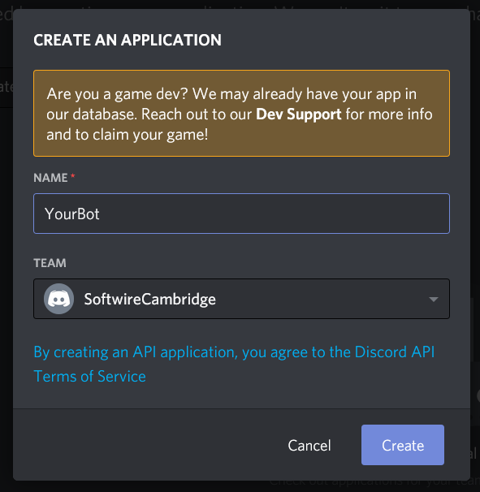
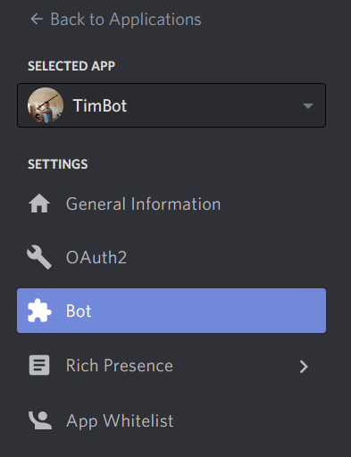
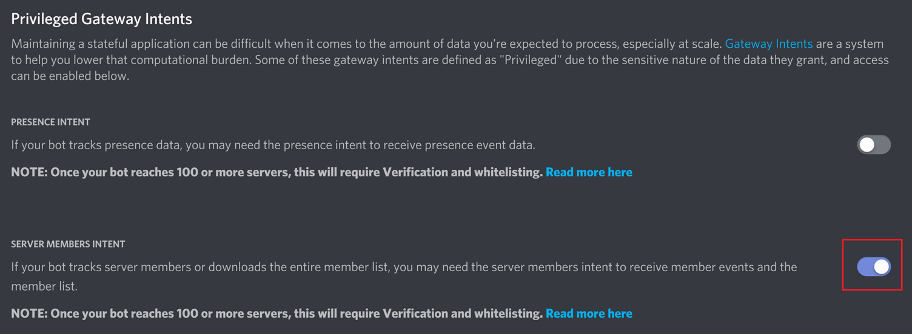
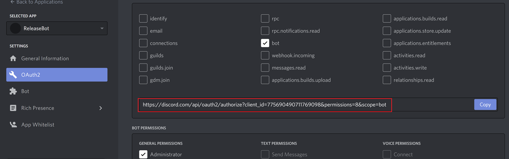

# Softwire Morale Event Discord Bot

This Discord bot makes it easier for morale event admins to organise events, and for people to sign up to those events.
It links up with Google Sheets to generate an at-a-glance list of all the events happening, and has other features to make this all easier.

## Setup

### Creating a bot for local testing

1. Have someone on the team add you to the SoftwireCambridge Discord developer team
2. Go to https://discord.com/developers/applications and click "New Application" in the top right
3. Name your local testing bot, making sure that the team is set to SoftwireCambridge


### Getting Google Sheets credentials

1. Talk to someone on the team (currently Benji) who can give you Google sheets credentials, and ask for them.
They will be given to you on [Zoho](https://vault.zoho.com/online/main), so raise a HYP request
to get access to the "Morale Event Discord Bot" chamber

### Running the bot locally

1. A few things need to be passed in as environment variables when you run locally. These are:
```
// Found on Discord for developers
RELEASE_BOT_TOKEN

// Given to you on Zoho
GOOGLE_SHEET_ID

// Found in the json file, also from Zoho
GOOGLE_CLIENT_EMAIL
GOOGLE_PROJECT_ID
GOOGLE_PRIVATE_KEY_ID
GOOGLE_PRIVATE_KEY
```

There is a template launchSettings.json.copy file in "DiscordBot/Properties/ServiceDependencies/", all you need to do is 
duplicate this file and remove ".copy" from it.

2. With your bot selected in Discord for developers, go to "Bot" on the left

3. You will need to give the bot the "Server members intent" under "Privileged Gateway Intents" to give it access to member events.

4. Copy the token on this page and pass it into your launchSettings.json as `RELEASE_BOT_TOKEN`
5. Pass in the `GOOGLE_SHEET_ID` and the four relevant fields in the JSON from Zoho
6. On the Discord developer page, select your app and go to "OAuth2", from here select "bot" and any permissions you want
the bot to have. Copy the generated link and paste it into your browser to add the bot to your testing server.

7. Run!
8. You will need to create and add a role name "Bot Whisperer" in your discord server and give that role to anyone that needs to use `?event` commands.

You should now be able to interact with your bot in the Discord server. Try saying `?event`!
